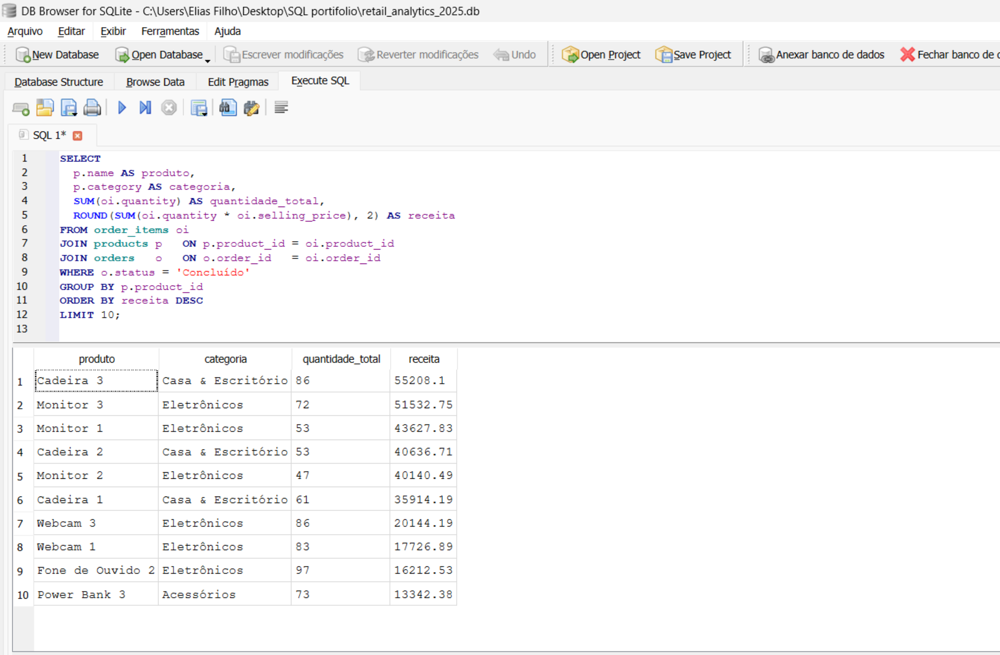

Result (CSV): [top10_products.csv](top10_products.csv)

# SQL Portfolio — Retail Analytics 2025

Este repositório apresenta análises de vendas com **SQL** usando um banco de dados fictício no varejo (2025).  
Tecnologias: **SQLite**, **SQL**, **Power BI/Excel (opcional para gráficos)**.

## Estrutura dos dados
- `customers` — clientes (cidade, estado, segmento, data de cadastro)
- `products` — produtos (categoria, subcategoria, preço, custo)
- `orders` — pedidos (data, canal, forma de pagamento, status)
- `order_items` — itens do pedido (quantidade, preço unitário, desconto, preço de venda)

> Período dos pedidos: **jan/2025 a ago/2025**

## Como usar
1. Baixe o arquivo `retail_analytics_2025.db` (SQLite) **OU** os CSVs.
2. Abra o banco no seu editor SQL favorito (DB Browser for SQLite, DBeaver etc.).
3. Rode as consultas do arquivo `queries_starter.sql`.
4. Exporte resultados importantes (CSV/PNG) e, se quiser, crie um dashboard (Power BI).

## Perguntas de Negócio (incluídas no `queries_starter.sql`)
1. Top 10 produtos por receita  
2. Top 5 clientes por receita + ticket médio  
3. Receita mensal (2025)  
4. Mix de receita por canal  
5. Margem bruta por produto (Top 10)  
6. Clientes com recompra (2+ pedidos)  
7. Taxa de devolução (%)  
8. Ticket médio por canal  
9. Top 5 subcategorias por receita  
10. Novos clientes por mês  

## Próximos passos (ideias)
- Criar **view** ou **CTE** para consolidar receitas por pedido.
- Construir um dashboard no **Power BI** com as principais KPIs.
- Publicar no LinkedIn prints das queries + insights.

---

**Autor:** Elias Filho — Data Analyst  
